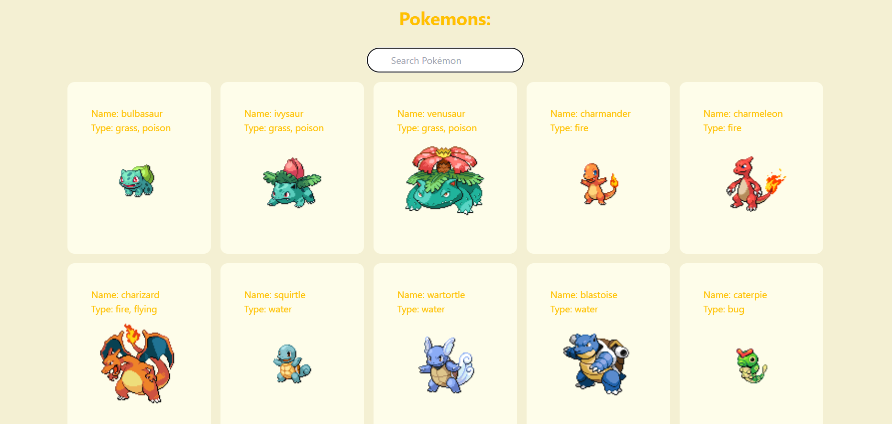

# Website for viewing lists of pokemons

This website has been developed by me (Kritika Adhikari). You are free to use the source code but ensure to give me credits. Thank you


> **Want to view a preview?** 



## 🚀 Project Structure

Inside of the project, you'll see the following folders and files:

```text
/
├── public/
│   └── pokemon.png
│   └── preview.png
├── src/
│   ├── components/
│   │   └── PokemonCard.tsx
│   │   └── PokemonList.tsx
│   │   └── SearchBar.tsx
│   ├── pages/
│   │   └── index.astro
│   └── utils/
│       └── api.ts
└── package.json
```


## Use the following commmands: 

To install dependencies

```sh
npm install
```

To start the local dev server (note that the server will start at localhost:4321)

```sh
npm run dev
```


## 🧞 Commands

All commands are run from the root of the project, from a terminal:

| Command                   | Action                                           |
| :------------------------ | :----------------------------------------------- |
| `npm install`             | Installs dependencies                            |
| `npm run dev`             | Starts local dev server at `localhost:4321`      |
| `npm run build`           | Build your production site to `./dist/`          |
| `npm run preview`         | Preview your build locally, before deploying     |
| `npm run astro ...`       | Run CLI commands like `astro add`, `astro check` |
| `npm run astro -- --help` | Get help using the Astro CLI                     |


